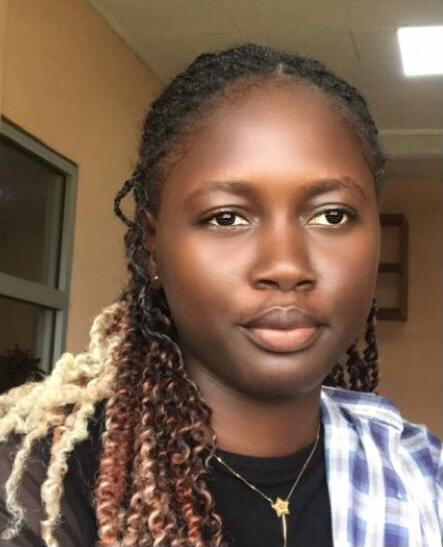

<!DOCTYPE html>
<html lang="fr">
<head>
    <meta charset="UTF-8">
    <meta name="viewport" content="width=device-width, initial-scale=1.0">
    <title>Portfolio - SIYEP NGANTCHOU Pharel</title>
    
    <link href="https://fonts.googleapis.com/css2?family=Poppins:wght@400;500;600;700&display=swap" rel="stylesheet">
</head>
<body>
    

        <header>
            <!-- Remplacez "chemin/vers/photo-profil.jpg" par votre photo -->
            

                
            

            

                <h1>SIYEP NGANTCHOU Pharel</h1>
                <h2>Développeuse Web Passionnée</h2>
                
                

                    

                        <svg width="18" height="18" viewBox="0 0 24 24" fill="none" stroke="currentColor" stroke-width="2">
                            <path d="M21 10c0 7-9 13-9 13s-9-6-9-13a9 9 0 0 1 18 0z"></path>
                            <circle cx="12" cy="10" r="3"></circle>
                        </svg>
                        Douala, Cameroun
                    

                    

                        <svg width="18" height="18" viewBox="0 0 24 24" fill="none" stroke="currentColor" stroke-width="2">
                            <path d="M22 16.92v3a2 2 0 0 1-2.18 2 19.79 19.79 0 0 1-8.63-3.07 19.5 19.5 0 0 1-6-6 19.79 19.79 0 0 1-3.07-8.67A2 2 0 0 1 4.11 2h3a2 2 0 0 1 2 1.72 12.84 12.84 0 0 0 .7 2.81 2 2 0 0 1-.45 2.11L8.09 9.91a16 16 0 0 0 6 6l1.27-1.27a2 2 0 0 1 2.11-.45 12.84 12.84 0 0 0 2.81.7A2 2 0 0 1 22 16.92z"></path>
                        </svg>
                        +237 658 87 01 08
                    

                    

                        <svg width="18" height="18" viewBox="0 0 24 24" fill="none" stroke="currentColor" stroke-width="2">
                            <path d="M4 4h16c1.1 0 2 .9 2 2v12c0 1.1-.9 2-2 2H4c-1.1 0-2-.9-2-2V6c0-1.1.9-2 2-2z"></path>
                            <polyline points="22,6 12,13 2,6"></polyline>
                        </svg>
                        <a href="mailto:manuelalorraine80@gmail.com">manuelalorraine80@gmail.com</a>
                    

                

            

        </header>

        <section class="about">
            <h3>À Propos de Moi</h3>
            

                Je suis une développeuse Web passionnée par l'informatique. Être toujours à la recherche 
                de techniques innovantes est mon centre d'intérêt principal. J'aime créer des solutions 
                web élégantes et fonctionnelles qui répondent aux besoins des utilisateurs.
            

        </section>

        <section>
            <h3>Disponibilités</h3>
            

                

                    <svg width="16" height="16" viewBox="0 0 24 24" fill="none" stroke="currentColor" stroke-width="2">
                        <circle cx="12" cy="12" r="10"></circle>
                        <polyline points="12 6 12 12 16 14"></polyline>
                    </svg>
                    Lundi à Vendredi: 08h - 17h
                

                

                    <svg width="16" height="16" viewBox="0 0 24 24" fill="none" stroke="currentColor" stroke-width="2">
                        <circle cx="12" cy="12" r="10"></circle>
                        <polyline points="12 6 12 12 16 14"></polyline>
                    </svg>
                    Samedi & Dimanche: 10h - 15h
                

            

        </section>

        <section>
            <h3>Compétences Techniques</h3>
            

                HTML/CSS
                JavaScript
                Développement Frontend
                UI/UX Design
                Résolution de problèmes
            

        </section>
    

</body>
</html>
